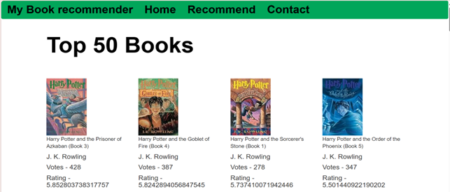
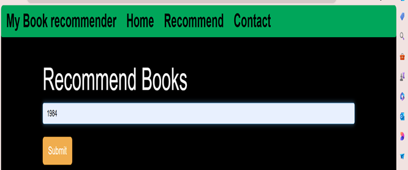
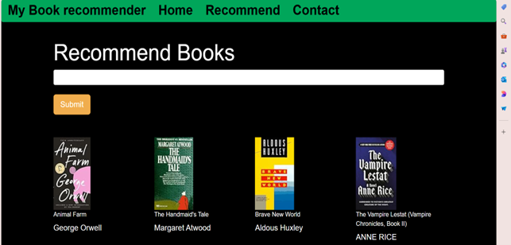
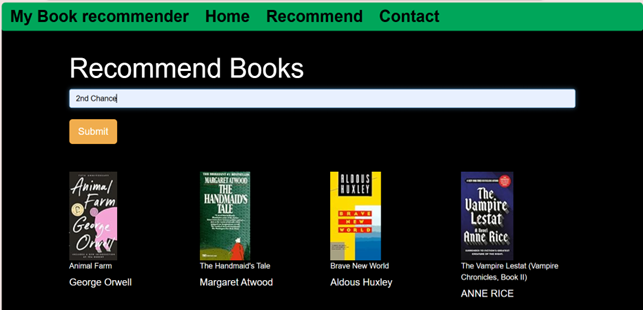
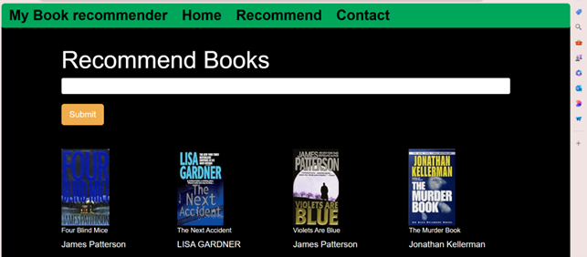

# 📚 Book Recommendation System

An **AI-powered Book Recommendation System** that suggests books based on user preferences, ratings, and content similarity. This system is built with **Python, Machine Learning, and Flask**, enhancing the reading experience by providing personalized book recommendations.

---

## 🚀 Project Overview
The **Book Recommendation System** uses data science techniques to analyze book features, user ratings, and content to provide accurate recommendations.

### **Features:**
- 📚 **Personalized Recommendations** based on user preferences
- ⭐ **Content-Based & Collaborative Filtering** for accurate suggestions
- 🔍 **Search Functionality** to quickly find books
- 📊 **User Ratings & Reviews Analysis**
- 🖥️ **Interactive Web Interface** built with Flask

---

## 🏗️ Tech Stack Used
| Technology | Purpose |
|------------|---------|
| **Python** | Core programming language |
| **Flask** | Web framework for UI and API |
| **Scikit-Learn** | Machine learning algorithms |
| **Pandas & NumPy** | Data preprocessing and analysis |
| **NLTK** | Natural language processing for book descriptions |
| **HTML, CSS, Bootstrap** | Frontend UI design |

---

## 🔧 Installation & Setup

### 1️⃣ **Clone the Repository**
```bash
git clone your git repository
cd Book_Recommendation_System
```

### 2️⃣ **Create a Virtual Environment (Optional but Recommended)**
```bash
python -m venv venv
source venv/bin/activate  # On macOS/Linux
venv\Scripts\activate    # On Windows
```

### 3️⃣ **Install Dependencies**
```bash
pip install -r requirements.txt
```

### 4️⃣ **Download the Dataset**
- Download the Book Recommendation dataset from **Kaggle**.
- Ensure that `users.csv`, `ratings.csv`, and `books.csv` are placed in the appropriate directory.

### 5️⃣ **Run the Application**
```bash
python app.py
```
- Open your browser and visit: `http://127.0.0.1:5000/`

---

## 🎯 How to Use It?
1. RUN THE APPLICATION
2. **Enter your favorite books** or select genres of interest.
3. **View recommended books** based on your preferences.
4. **Search for specific books** and read details.
---

## 📷 Screenshots

### Home Page


### Recommendation Page








---

## 🤝 Contributing
We welcome contributions! Follow these steps:
1. **Fork the repository**
2. **Create a new branch** (`feature-new-feature`)
3. **Commit your changes** (`git commit -m "Added a new feature"`)
4. **Push to GitHub** (`git push origin feature-new-feature`)
5. **Open a Pull Request**

---

## 📝 License
This project is **open-source** and available under the **MIT License**.

---

### ⭐ Give a Star!
If you find this project useful, don't forget to ⭐ the repository!

